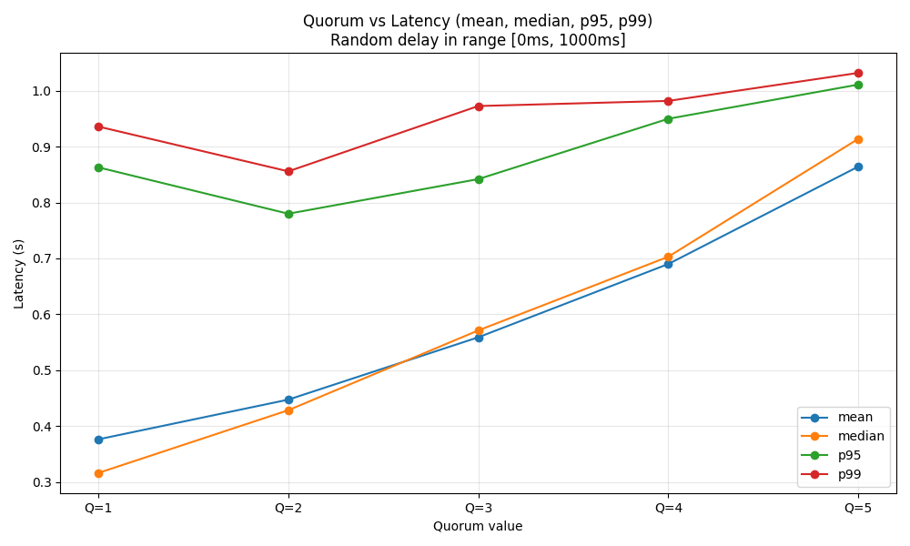

# **Leader-Follower**

### *Performance Analysis & Quorum-Based Latency Study*

---

## **1. Introduction**

This project implements a distributed **key–value store** following the **Single-Leader Replication** model described in Martin Kleppmann’s *Designing Data-Intensive Applications* (DDIA), Chapter 5 (“Leaders and Followers”).

A single **leader node** accepts all client writes and replicates them to **five follower nodes** using **semi-synchronous replication**:

* The leader broadcasts each write to all followers concurrently.
* The leader waits for a **configurable quorum** (1–5 ACKs) before responding.
* Each follower applies the update immediately.
* Artificial network delay is added `[0ms – 1000ms]` to simulate a real-world distributed environment.

The system runs in **Docker Compose**, each node in its own container, communicating over **HTTP + JSON** using FastAPI.

We conduct an experiment performing **100 concurrent writes** (10 at a time) to measure:

1. **Write latency** vs **quorum size**
2. **Consistency** between leader and followers after all writes

---

## **2. System Architecture**

### **2.1 Components**

* **Leader node**

  * Accepts writes (`PUT /kv/{key}`)
  * Applies them locally
  * Sends replication RPCs concurrently to all followers
  * Waits for *quorum* acknowledgements before returning success

* **Follower nodes**

  * Accept replication RPCs (`POST /replicate/{key}`)
  * Apply the write to local memory

* **Client (experiment script)**

  * Issues batched write operations
  * Measures latency
  * Collects percentile statistics (mean, median, p95, p99)
  * Validates state consistency

---

## **3. Quorum and Semi-Synchronous Replication**

A **quorum** is the **minimum number of follower acknowledgments** the leader must receive before confirming a write.

Let:

* **N = 5 followers**
* **W = write quorum**

| W (quorum) | Meaning                                               |
| ---------- | ----------------------------------------------------- |
| **1**      | Fastest, least durable (only 1 follower must respond) |
| **3**      | Balanced durability & performance                     |
| **5**      | Most durable, slowest (all followers must ACK)        |

This mechanism models the trade-off between **latency** and **durability** in real-world distributed databases (Cassandra, Dynamo, Raft).

---

## **4. Experimental Setup**

### **4.1 Artificial Network Delay**

Each replication RPC includes a randomized delay:

```
MIN_DELAY_MS = 0
MAX_DELAY_MS = 1000
```

Different followers experience different delays.

### **4.2 Load Test**

* **100 total writes**
* **10 concurrent writes**
* **10 unique keys (k0 – k9)**

### **4.3 Metrics Collected**

For each quorum value (1 → 5):

* **Mean latency**
* **Median latency**
* **p95 latency (95th percentile)**
* **p99 latency (99th percentile)**

### **4.4 Consistency Validation**

After all writes:

* Read `/debug/store` from leader
* Compare with each follower's store

---

## **5. Results**

### **5.1 Latency Graph (mean, median, p95, p99)**

> (Insert your generated plot here: **`quorum_vs_latency_full.png`**)
> Example:

```

```

---

## **6. Interpretation of Results**

### **6.1 Why does latency increase with quorum?**

Increasing the quorum forces the leader to wait for **more followers**:

* With **Q=1**, the leader returns as soon as **any follower** responds → fastest
* With **Q=5**, the leader must wait for **the slowest follower** → slowest
* The artificial random delay amplifies this effect

**Expected outcome:**
A monotonically increasing latency curve as quorum increases.

### **6.2 Why do p95 and p99 spike?**

Percentiles capture **tail latency**:

* The slowest 1–5% of RPCs are affected by:

  * Random 1-second delays
  * Uvicorn event loop scheduling
  * Docker container overhead
  * Occasional timeouts or slowness

This reflects real-world distributed systems, where the tail (p99) often dominates large-scale performance.

---

## **7. Consistency Analysis**

### **Observed Behavior**

After all writes:

* **Followers that acknowledged writes** have consistent data.
* Followers that were **slow / timed out** may miss some writes.
* This is expected with **semi-synchronous replication**:

  * The leader returns success once quorum is reached
  * Followers outside the quorum may fall behind

### **Implications**

* **Q=1** risks high inconsistency
* **Q=3** provides reasonable consistency
* **Q=5** ensures all followers are fully consistent

This matches DDIA's discussion of consistency trade-offs.

---

## **8. Discussion**

### **8.1 Why were latencies sometimes ~2 seconds despite random delay of only 0–1s?**

Because of:

1. **Timeout effects** (`REPLICATION_TIMEOUT_S = 2.0s`)
2. Leader waiting for slow tasks even after quorum
3. Non-cancelled background tasks

Thus, the *timeout* became the dominant source of latency—not the artificial delay.

### **8.2 Improving accuracy**

To measure true delay behavior:

* Reduce timeout
* Cancel replication tasks once quorum is reached
* Implement a clean k-minimum aggregator for replication responses

---

## **9. Conclusion**

This experiment demonstrates:

* **Quorum size directly impacts write latency**
* **Higher quorum → higher durability and consistency**
* **Tail latency (p95/p99)** reveals slow follower behavior
* **Semi-synchronous replication** is a trade-off between performance and safety
* **Timeouts and slow tasks** can dominate system behavior in practice

The results reflect the core principles of distributed replication from DDIA and provide a realistic understanding of quorum-based replication dynamics.

