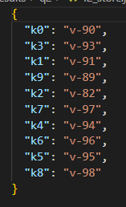
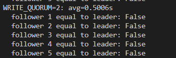
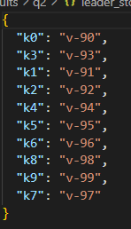

# **Leader - Follower**


## **1. Introduction**

The goal of this laboratory work is to implement a **distributed key-value store** using the **Single-Leader Replication** model described in *Designing Data-Intensive Applications* by Martin Kleppmann (Chapter 5, Section 1: *“Leaders and Followers”*).

The implementation consists of:

* One **leader** replica that accepts write requests.
* Five **follower** replicas that apply updates received from the leader.
* All nodes run concurrently in separate Docker containers using **docker-compose**.
* The replication process uses **semi-synchronous replication**, where:

  * The leader returns success to the client **after a configurable number of followers acknowledge** the write.
  * This number is called the **write quorum (W)** and is set through environment variables.

To emulate real-world distributed systems, the leader introduces a **random network delay** between `[MIN_DELAY, MAX_DELAY]` before sending replication requests to followers.

The experiment evaluates system performance for **five quorum values** (1–5) and inspects if the followers remain consistent with the leader after the entire workload.

---

## **2. System Architecture**

### **2.1 Components**

#### **Leader Node**

* Accepts all HTTP `PUT /kv/{key}` write operations.
* Immediately applies the update locally.
* Sends **replicate RPCs** to all followers concurrently.
* Waits for **W successful acknowledgments** before returning success to the client.
* Uses random delay per follower to simulate network jitter.

#### **Follower Nodes**

* Only accept replication RPCs: `POST /replicate/{key}`.
* Apply values to local memory immediately.
* Do not accept direct client writes.

#### **Client / Performance Script**

* Issues 100 total writes, with 10 writes happening concurrently.
* Rotates between 10 distinct keys (`k0`–`k9`).
* Measures latency of each write request.
* Collects mean, median, p95, p99 for each quorum.
* Saves leader + follower databases for offline inspection.
* Generates a latency plot for all quorum values.

### **2.2 API Endpoints**

| Endpoint                | Node               | Description                  |
| ----------------------- | ------------------ | ---------------------------- |
| `GET /health`           | Leader & Followers | Health check                 |
| `GET /kv/{key}`         | Leader             | Read current value           |
| `PUT /kv/{key}`         | Leader             | Write + replicate            |
| `POST /replicate/{key}` | Follower           | Apply replication update     |
| `GET /debug/store`      | All                | Debug view of internal store |

### **2.3 Configuration via Environment Variables**

All nodes are configured through Docker environment variables:

* `ROLE=leader|follower`
* `FOLLOWERS=http://f1:8000,...`
* `WRITE_QUORUM=1..5`
* `MIN_DELAY_MS`
* `MAX_DELAY_MS`
* `REPLICATION_TIMEOUT_S`
* `GLOBAL_REQUEST_TIMEOUT_S`

---

## **3. Replication Model**

### **3.1 Single-Leader Replication**

Only the leader receives writes. All followers passively apply updates sent from the leader. This matches the model described in DDIA: a centralized sequence of writes is maintained through replication.

### **3.2 Semi-Synchronous Replication**

When the leader receives a write:

1. It applies the value locally.
2. It sends replication RPCs to all 5 followers **concurrently**.
3. It waits for at least **W followers to send success**.
4. Once W acknowledgments are received, the leader **returns success**, even if the remaining followers have not finished yet.

This makes the system:

* **Safer than asynchronous replication**, because a subset of followers must confirm the write.
* **Faster than fully synchronous replication**, because not all followers need to confirm.

### **3.3 Write Quorum Values Tested**

We test:

```
W = 1, 2, 3, 4, 5
```

With:

* 1 = minimal durability, lowest latency
* 5 = full synchronization, highest latency

---

## **4. Integration Test**

An automated integration test suite verifies the system correctness:

### ✔ Cluster becomes healthy

### ✔ Leader accepts writes and responds correctly

### ✔ Followers apply replication updates

### ✔ Quorum logic behaves as expected (invalid quorum → write fails)

### ✔ After multiple writes, follower state matches leader state

These tests run against the real Docker deployment to ensure full-system correctness.

---

## **5. Performance Experiment Setup**

### **5.1 Workload**

* **100 total writes**
* **10 concurrent writes at a time**
* **10 rotating keys**
* Leader performs:

  * Local write
  * Concurrent replication to all followers
  * Waits for quorum acknowledgments

### **5.2 Artificial Network Delay**

The leader applies:

```
delay = random.uniform(MIN_DELAY_MS, MAX_DELAY_MS) / 1000
```

with:

```
MIN_DELAY_MS = 0
MAX_DELAY_MS = 1000
```

This creates divergence in follower response times and simulates real network jitter and tail latency.

### **5.3 Measurements**

For each quorum, we collect:

* Mean latency
* Median latency
* p95 latency (95th percentile)
* p99 latency (99th percentile)
* Consistency snapshot of all DBs after test finishes

A plot named:

```
quorum_vs_latency_full.png
```

is generated.

---

## **6. Results**

### **6.1 Latency vs Quorum Plot**


.png)


### **6.2 Interpretation of Performance Results**

#### **Latency increases with quorum**

* With `W = 1`, the leader only waits for the fastest follower ⇒ lowest latency.
* With `W = 5`, the leader must wait for **all** followers ⇒ slowest latency.
* Intermediate values show smooth, increasing latency.

This follows the principle discussed in DDIA:

> “A higher replication requirement increases durability but also increases latency, especially due to tail latency in distributed environments.”

#### **Tail latencies dominate**

p95 and p99 show significantly higher values because:

* Some follower delays approach 1000 ms
* Python async scheduling & Docker overhead introduce jitter
* Timeouts near 2 seconds impact slow followers

This reflects real distributed system behavior: the slowest replica becomes the bottleneck at high quorum.

---

## **7. Consistency Check**

For each quorum, the final key-value databases of:

* leader
* follower 1
* follower 2
* follower 3
* follower 4
* follower 5

are saved automatically.

### **7.1 Observed Behavior**



For quorums that are smaller then 5 the data is inconsistent thorugh separate followers and the leader because of race condition.




This is expected for semi-synchronous replication and is explicitly discussed in DDIA.For reference the leaders key values look like this at the end of the test with quorum 2.



### **7.2 Explanation**

When **quorum < N**, background tasks might:

* time out
* be delayed 
* finish before the previous one ( **race condition** )

Thus, consistency is **not guaranteed** unless:

```
WRITE_QUORUM == number_of_followers
```

This confirms the theory:

> “Semi-synchronous replication does not guarantee full consistency unless all replicas are required to acknowledge.”

---

## **8. Conclusions**

This laboratory verified the concepts explained in Chapter 5 of *Designing Data-Intensive Applications*:

Single-leader replication implemented

Semi-synchronous replication with configurable quorum

Full concurrent replication using asyncio

Network delay simulation

Integration tests for correctness

Performance analysis for W=1..5

Consistency comparison between leader and followers

### **Key Takeaways**

* Increasing quorum increases write latency due to waiting for more follower acknowledgments.
* Tail latency dominates at higher quorums because the slowest follower controls overall performance.
* Full consistency (all followers = leader) is guaranteed only when quorum equals the total number of followers.
* Lower quorums improve performance but reduce consistency guarantees.

This system provides a realistic model of real-world distributed databases such as Cassandra, MongoDB (replica sets), and traditional master-slave architectures.

---

## **9. Appendix**

### Files included:

* `app.py` – complete leader/follower implementation
* `docker-compose.yml` – deployment of leader + 5 followers
* `perf_test.py` – load generation, latency measurement, snapshot saving, plotting
* `test_integration.py` – integration tests
* `quorum_vs_latency_full.png` – generated plot
* `data/` – per-node stored databases per quorum
